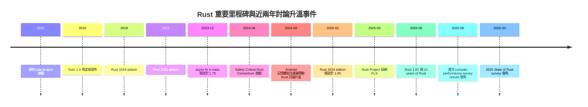
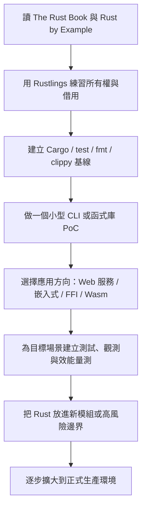

# Rust 語言完整分析報告

## Executive Summary

Rust 的核心價值，不只是「比 C/C++ 更安全」，而是把原本常在執行期才暴露的記憶體與並行錯誤，盡可能前移到編譯期處理。它以所有權、借用、生命週期、trait 與嚴格型別系統，建立出一套兼顧系統級性能、原生部署能力與高可靠性的工程模型；同時又不像 Go、Java、Python 那樣依賴垃圾回收器作為主要記憶體管理策略。這使 Rust 特別適合安全敏感元件、高效能網路服務、嵌入式、WebAssembly、系統工具，以及現有大型 C/C++ 系統中的高風險模組替換。代價則是明顯的：學習曲線較陡、編譯時間往往高於 Go/Python，async/unsafe/FFI 等進階主題需要較成熟的工程規範。對技術決策者而言，Rust 最值得採用的情境通常是「新模組、新服務、新安全邊界」，而不是對既有大型程式碼庫做一次性全面重寫；最佳策略通常是以互操作與漸進替換為主。citeturn12search12turn10search0turn24view0turn17search20turn27search0

## 語言概述

Rust 起源於 2010 年，最初由 entity["people","Graydon Hoare","rust creator"] 發起，後來在 urlMozillahttps://www.mozilla.org/ 旗下研究團隊中成長；2015 年釋出 1.0 穩定版後，官方即明確把它定位為一門追求「可靠、有效率、適合系統程式」的語言。官方首頁至今仍把「高效能、可靠性、生产力」當作 Rust 的核心敘事，並強調它不需要垃圾回收器或大型必備 runtime，因此可用於高效能服務、嵌入式裝置與跨語言整合。依 2026-05-12 可見的正體中文官方頁面，當前穩定版本已為 1.95.0。citeturn11search0turn10search0turn12search12turn10search4

Rust 的設計目標可以濃縮成三件事。第一，是在 safe code 中消除大量記憶體不安全與資料競爭；第二，是維持接近 C/C++ 的低階控制權與原生部署能力；第三，是把現代語言體驗——如代數資料型別、模式匹配、泛型、trait、模組化工具鏈——整合進系統程式領域。這種定位使 Rust 同時對「寫 OS 元件、驅動、資料平面服務」與「寫高可靠後端、CLI、邊緣運算程式」都具吸引力。citeturn10search0turn12search12turn10search4

治理上，技術決策由 Rust Project 多個團隊共同推動，而基礎設施、社群與資安支持則由獨立的 entity["organization","Rust Foundation","rust nonprofit"] 協助承接。官方治理頁面顯示，目前 Rust Project 有 120 個活躍團隊，官方團隊成員超過 300 人；官方社群頁則列出全球超過 90 個 meetup、涵蓋 35 個以上國家。這代表 Rust 已不是單一語言設計者主導的小社群，而是具備多中心治理與全球協作能力的成熟開源專案。citeturn14search2turn21search2turn21search11turn22view0



上圖中的歷史節點與近兩年討論升溫事件，分別對應官方版本公告、年度調查、規格化工作、Safety-Critical 與互操作計畫，以及 Android/firmware 採用案例。特別是 2025 年 Rust 2024 edition 穩定、FLS 被採納、10 週年活動，以及 2025 compiler performance survey 的大量回應，都顯示社群討論焦點正從「Rust 能不能用」轉向「Rust 如何更大規模、可規範、可互操作地用」。citeturn38search0turn10search8turn12search1turn12search3turn14search4turn13search2turn13search0turn24view0turn17search0

| 指標 | 最近可見數值 | 解讀 |
|---|---:|---|
| Stack Overflow 2024 admired | 83% citeturn15search8 | 開發者偏好度極高 |
| State of Rust 2024 自評「可生產」 | 53% citeturn24view1 | 生產力門檻雖高，但熟練者比例上升 |
| State of Rust 2024 幾乎每日使用 | 53% citeturn24view1 | 工作場景使用度上升 |
| Compiler Performance Survey 2025 回覆數 | 3,700+ citeturn24view0 | 編譯時間已成主要工程議題 |
| 官方 meetup 規模 | 90+、35+ 國家 citeturn22view0 | 社群具全球組織能力 |

參考來源：urlRust 官方網站turn12search12、urlRust Releasesturn10search9、urlRust 社群頁面turn22view0、urlRust Foundation 關於頁turn14search2、url2024 State of Rust Survey Resultsturn15search2、url2025 State of Rust Survey Resultsturn15search3、url2025 Rust compiler performance survey resultsturn15search6、url2024 Stack Overflow Developer Surveyturn15search11

## 核心語法與語意

**型別系統、泛型與 trait。** Rust 是靜態型別語言，但保有相當強的型別推導能力。它以 `struct`、`enum`、模式匹配與 trait 為核心語意骨架：`enum` 讓錯誤、可選值、狀態機等抽象能以型別表達；trait 則同時扮演「介面」「能力約束」「多型抽象」的角色。這與 Java 的 class/interface 模型、Go 的 interface、以及 C++ 的 template/concepts 有相似處，但 Rust 的 trait 通常與所有權、`Send`/`Sync`、`Copy`、`Unpin` 等語意安全條件緊密耦合，因此它不只是抽象工具，也是安全邊界的一部分。泛型路徑大多在後端 codegen 時單態化，這使抽象能保留接近手寫程式碼的性能特性。citeturn23search2turn16search12turn32search1turn32search13turn32search19

參考來源：urlRust Referenceturn23search2、urlThe Rust Bookturn33search10、urlrustc-dev-guide：Lowering MIR to Codegen IRturn32search1

**所有權、借用與生命週期。** 這是 Rust 與主流程式語言最大的語意差異。Rust 預設對非 `Copy` 型別採 move semantics；借用規則要求「同一時間可以有多個不可變參考，或恰好一個可變參考」。生命週期不是垃圾回收，也不是執行期 metadata；它主要是編譯器用來描述「參考關係有效到哪裡」的靜態約束。對工程師而言，這表示資料結構設計、API 介面、可變性與共享策略，都必須更早在型別層被釐清。對決策者而言，這也是 Rust 為何能把大量錯誤前移到編譯期的根本原因。citeturn2search0turn16search4turn16search8turn33search17turn39search11

```rust
fn main() {
    let s = String::from("hello");
    let t = s;            // move
    // println!("{s}");   // E0382: use of moved value
}
```

上例顯示 Rust 不是默默複製所有資源型別，而是預設把所有權轉移；這與 C 的裸指標、C++ 的可複製/可移動型別、Java/Python 的參考語意非常不同。代價是初學者會頻繁碰到 borrow checker；收益則是 use-after-free、double free、共享可變狀態等問題更容易在編譯期被阻斷。citeturn16search8turn16search4turn2search0

參考來源：urlThe Rust Book：References and Borrowingturn2search0、urlError Index：E0382turn16search8、urlError Index：E0499turn16search4、urlThe Rustonomicon：Lifetimesturn39search11

**錯誤處理。** Rust 將錯誤分成可恢復與不可恢復兩類：可恢復錯誤通常使用 `Result<T, E>`，不可恢復錯誤則用 `panic!`。這與 Go 的顯式 `error` 回傳風格相近，但 Rust 的 `Result` 直接融入型別系統與 `?` 運算子，因此錯誤傳遞可顯式又不至於樣板過多；同時又避免像 Java/Python 那樣大量依賴例外機制作流程控制。`panic!` 預設會 stack unwind，也可設定為直接 abort，在嵌入式或極致精簡部署情境中很重要。citeturn34search0turn34search4turn34search8turn34search11

```rust
fn read_cfg() -> Result<String, std::io::Error> {
    std::fs::read_to_string("app.toml")
}
```

參考來源：urlThe Rust Book：Error Handlingturn34search0、urlThe Rust Book：Recoverable Errors with Resultturn34search4、urlThe Rust Book：panic!turn34search8

**並行與非同步模型。** Rust 同時支持 OS threads 與 `async/.await`。執行緒面向上，官方把它稱為「fearless concurrency」：語言把共享/可變/轉移的條件編進型別，例如 `Send` 代表型別可跨執行緒移轉，`Sync` 代表可安全共享引用。非同步面向上，`async fn` 不會自動建立背景執行緒，而是把函式轉成實作 `Future` 的狀態機；真正的執行由 runtime/executor 負責，runtime 通常會同時提供 reactor 與 executor。這個模型的好處是執行成本可低、可預測，且不必引入語言層 GC；壞處是 pinning、waker、runtime 相依性、trait object 與 async trait 的邊界都更難理解。citeturn2search8turn32search7turn32search3turn33search2turn33search9turn33search18turn12search3

```rust
async fn work() -> u32 { 42 }
```

`async fn` 這種語法糖的本質，不是「啟動一條新執行緒」，而是「建立一個可被 poll 的 Future」。當 `.await` 遇到尚未完成的 I/O，Future 會讓出控制權，由 executor 在適當時機再喚醒。這與 Go 的 goroutine、Java 的 virtual threads、Python 的 asyncio tasks 都有相似之處，但 Rust 把更多成本與正確性問題顯式地留給型別與 runtime 邊界來處理。citeturn33search9turn33search15turn33search18turn33search13

參考來源：urlThe Rust Book：Fearless Concurrencyturn2search8、urlThe Rust Book：Async, Await, Futures, and Streamsturn33search6、urlAsync Bookturn33search1、urlPin in std::pinturn33search0、urlAnnouncing async fn in traitsturn12search3

**宏系統。** Rust 的宏不是單純文字替換。官方將其區分為宣告式巨集 `macro_rules!` 與三種 procedural macros：derive、attribute、function-like。巨集讓 Rust 能在維持類似語法一致性的前提下，擴充大量樣板生成、序列化推導、Web framework 路由註記、FFI glue code 等能力。工程上，這是 Rust 生態生產力的重要來源；風險則是錯誤訊息與展開後行為有時較難直觀理解。citeturn33search3turn33search7

參考來源：urlThe Rust Book：Macrosturn33search3、urlThe Rust Book：Macros Overviewturn33search7

**unsafe、內存模型與資料競爭。** `unsafe` 不是關掉所有檢查，而是把「編譯器無法保證的部分」局部化。官方書明確列出五種只有在 `unsafe` 中才能做的事：解參考 raw pointer、呼叫 unsafe 函式或方法、存取可變靜態變數、實作 unsafe trait、存取 `union` 欄位。更重要的是，Rustonomicon 強調 Unsafe Rust 與 Safe Rust 共享同一套語言語意；unsafe 只是允許你承擔額外不變式責任。Rust Reference 也提醒，目前記憶體模型仍在發展中，而且 Rust 使用「抽象位元組」概念處理未初始化值、部分指標位元與 provenance 問題。對工程實務來說，這意味著 safe Rust 可以提供很強的保證，但一旦進入 unsafe/FFI，就必須用嚴格 API 封裝、審查與測試把風險收斂到最小表面積。citeturn41view0turn41view1turn41view2turn39search0turn39search3turn39search6

```rust
unsafe extern "C" {
    safe fn abs(input: i32) -> i32;
}
```

雖然 safe Rust 大幅限制資料競爭，但 raw pointer 可以同時建立可變與不可變指向同一位置的指標，導致競態風險；因此 Rust 把此類操作放入 `unsafe`，並要求開發者在 API 邊界承諾其 soundness。`Send` 與 `Sync` 則把「可移轉」「可共享」的多執行緒條件轉成型別屬性。這是 Rust 與 C/C++ 在並行正確性上的本質差異。citeturn41view0turn32search7turn32search3

參考來源：urlThe Rust Book：Unsafe Rustturn41view0、urlThe Rustonomiconturn39search5、urlFFI in the Rustonomiconturn41view2、urlRust Reference：Memory modelturn39search0

**編譯器錯誤訊息與診斷。** Rust 的診斷能力是其開發者體驗的一大優勢。`rustc-dev-guide` 直接寫明，編譯器在 error message 上投入了大量心力；官方錯誤索引則把常見錯誤整理成具代號、帶解釋與修正方向的文件，例如 E0382（use after move）、E0499（同時多個 mutable borrow）、E0277（trait bound 不成立）。這讓 Rust 的「嚴格」通常不是靜默拒絕，而是具體指出不變式哪裡被破壞。對學習者來說，它依然陡峭；但對團隊來說，這種把規則具體化的診斷，往往能降低 code review 中的語意誤解成本。citeturn16search2turn16search8turn16search4turn16search12

參考來源：urlrustc-dev-guide：Errors and lintsturn16search2、urlError Index：E0382turn16search8、urlError Index：E0499turn16search4、urlError Index：E0277turn16search12

## 記憶體安全與性能分析

**記憶體安全的本質。** Rust 官方首頁把「ownership model 保證 memory-safety 與 thread-safety」視為主要賣點，而 Rustonomicon 更進一步指出：若只寫 Safe Rust，理論上不必面對 dangling pointer、use-after-free 與其他 undefined behavior 類問題。這比 C/C++「以工具、規範、RAII、sanitizer 補救」的方向更激進，因為它不是以測試去發現錯，而是以型別與借用規則先排除一大批錯。citeturn12search12turn10search4turn41view1

參考來源：urlRust 官方網站turn12search12、urlThe Rustonomicon：Meet Safe and Unsafeturn41view1

**性能定位。** Rust 的性能優勢主要來自三個面向：沒有 GC pause、沒有強制性大型 runtime、能精細控制配置與資料布局。這使它在 tail latency、固定資源預算、裸機或 edge 情境中特別有吸引力。不過，這不代表 Rust 自動比 C/C++ 更快，也不代表它在所有工作負載都比 Go/Java 更快；官方與社群近年的焦點反而愈來愈集中在「如何維持高性能同時改善 build time 與工程生產力」。本文因此不採單一通用 benchmark 排名，因為使用者未指定測試集，而跨 workload 的比較很容易誤導。citeturn10search0turn12search12turn24view0

參考來源：urlAnnouncing Rust 1.0turn10search0、urlRust 官方網站turn12search12、url2025 Rust compiler performance survey resultsturn15search6

**零成本抽象。** 在 Rust 的工程語境裡，零成本抽象通常指的是：你可以用泛型、iterators、closures、trait bounds、pattern matching 等較高層抽象寫程式，但在編譯管線中，程式會先降到 MIR，再做 MIR 層優化，最後通常轉成 LLVM IR 做後端最佳化。由於 MIR 仍是泛型形式，許多優化可以在單態化前就先套用；這既改善最終執行碼，也減少 LLVM 的後端負擔。從實作角度看，這正是「抽象不必強迫付出執行期成本」的技術基礎。citeturn32search12turn32search15turn32search1turn32search5

參考來源：urlrustc-dev-guide：The MIRturn32search12、urlrustc-dev-guide：MIR optimizationsturn32search15、urlrustc-dev-guide：Lowering MIR to Codegen IRturn32search1

**限制與代價。** Rust 的主要成本不是執行期，而是編譯期與心智負擔。2025 compiler performance survey 指出，增量重建、連結階段、`cargo check` 與 `cargo build` 快取不共享等問題，已明顯影響生產力；另一些 async 使用者則反映 pinning、生命週期與 runtime 相依組合會提升維護難度。unsafe/FFI 也意味著：Rust 不是「完全沒有風險」，而是把風險壓縮到較少但更需要審核的區塊。citeturn24view0turn33search5turn41view0turn41view2

參考來源：url2025 Rust compiler performance survey resultsturn15search6、urlAsync Book：State of Async Rustturn33search5、urlThe Rust Book：Unsafe Rustturn41view0

## 編譯器工具鏈與生態

`rustc` 的核心編譯流程，大致可理解為：前端解析與型別分析後，把 HIR 進一步降成 MIR；MIR 會用於借用檢查、部分 flow-sensitive 安全分析，以及中階優化；之後再降到 codegen IR，通常是 LLVM IR，最後交由 LLVM 完成機器碼生成。這種分層讓 Rust 同時能做語意檢查、錯誤診斷、中階優化與後端最佳化，是它既能保持高階抽象、又能輸出原生碼的重要原因。citeturn32search5turn32search12turn32search1turn32search15

參考來源：urlrustc-dev-guide：Overview of the compilerturn32search5、urlrustc-dev-guide：The MIRturn32search12、urlLLVM Overviewturn32search4

在日常工程流程中，Cargo 幾乎是 Rust 生態的中心。官方文件將 Cargo 定位成建置、套件、命令列工作流的統一入口；與之搭配的 `clippy`、`rustfmt`、`rust-analyzer` 則分別補上 lint、格式化與 IDE/LSP 體驗。這種「工具鏈預設整合」是 Rust 與 C/C++ 的明顯差異：後者通常需要自己組裝編譯器、建置系統、formatter、linter、套件管理器與 IDE plugin，而 Rust 則把大多數核心體驗收斂成較一致的工作流。citeturn5search20turn5search17turn40search2

參考來源：urlCargo Bookturn5search20、urlClippy Lintsturn5search17、urlrust-analyzer manualturn40search2、urlrustfmthttps://github.com/rust-lang/rustfmt

套件生態方面，urlcrates.ioturn30search0 是官方 crate registry，urldocs.rsturn30search11 則是所有發佈到 registry 的 crate 文件託管站。近年 Rust Foundation 在安全面也明顯加碼：2024 年報顯示，Foundation 的 Security Initiative 在供應鏈安全、typosquatting 偵測、前 5,000 個 crate provenance 追蹤與即時安全掃描上都有實作成果。這代表今日評估 Rust 生態，不能只看 crate 數量，也要看治理、文件、供應鏈安全與基礎設施成熟度。citeturn30search0turn30search11turn28view0

參考來源：urlcrates.ioturn30search0、urlDocs.rs about pageturn30search11、urlRust Foundation Annual Report 2024turn14search18

下表列出 10 個常用 crate 與工具。成熟度評分為本報告依文件完整度、維護活躍度、跨專案採用與穩定性所做的主觀評估：

| 名稱 | 類型 | 主要用途 | 成熟度 | 簡評 |
|---|---|---|---|---|
| urlCargoturn5search20 | 工具 | 建置、測試、依賴管理、workspace | 高 | 幾乎是 Rust 開發流程的標準入口 |
| urlClippyturn5search17 | 工具 | 靜態 lint、慣用法檢查 | 高 | 對團隊一致性與 code review 品質很有幫助 |
| urlrustfmthttps://github.com/rust-lang/rustfmt | 工具 | 格式化 | 高 | 大幅降低風格爭議 |
| urlrust-analyzerturn40search2 | 工具 | IDE/LSP、補全、跳轉、型別資訊 | 高 | 現代 Rust DX 的關鍵組件 |
| urlSerdeturn30search2 | crate | 序列化與反序列化 | 高 | 事實標準，幾乎所有服務端專案都會碰到 |
| urlTokioturn30search3 | crate | async runtime、非阻塞 I/O | 高 | Rust Web 與網路服務最常見底座之一 |
| urlwasm-bindgenturn18search3 | crate | Rust 與 JavaScript / Wasm 橋接 | 高 | WebAssembly 場景核心工具 |
| urlcxxturn27search2 | crate | Rust/C++ 安全互操作 | 中 | 對既有大型 C++ 碼庫導入 Rust 很重要 |
| urlPolarsturn19search8 | crate | DataFrame 與欄式分析 | 中 | Rust 資料科學生態的代表作之一 |
| urlPyO3turn19search2 | crate | Python 擴充模組與雙向互通 | 高 | 讓 Rust 進入 Python/資料科學工作流非常實用 |

表中各項用途依專案官方說明整理；例如 Serde 明確定位為高效率、泛型序列化框架，Tokio 定位為 event-driven、non-blocking I/O 平台，`cxx` 強調 Rust/C++ 雙向安全互通，`wasm-bindgen` 則明確服務於 Rust 與 JavaScript 之間的高階互動。citeturn30search2turn30search3turn27search2turn18search3turn19search8turn19search2

## 典型應用與跨語言比較

Rust 的典型應用領域已相當清晰。系統程式方面，urlLinux kernelhttps://www.kernel.org/ 官方文件已設有完整 Rust 章節與 quick start；網路服務方面，urlCloudflarehttps://www.cloudflare.com/ 先前公開說明其 Rust 化的請求處理架構 FL2 帶來顯著網路效能改善，之後又把 Foundations 開源，作為分散式 Rust 服務的共用基礎函式庫。嵌入式與 firmware 方面，urlGooglehttps://www.google.com/ 於 2024 年公開介紹如何在既有 firmware codebase 中漸進導入 Rust，2026 年又展示把 Rust DNS parser 帶入 Pixel baseband firmware 的案例。WebAssembly 方面，官方 Rust and WebAssembly Book 與 wasm-bindgen Guide 已形成一條成熟開發路線；資料科學方面，Polars、Arrow、PyO3、Maturin 讓 Rust 能以「高速核心 + Python 使用體驗」的形式切入現有工作流。citeturn17search2turn17search6turn17search11turn17search7turn17search20turn17search8turn18search0turn18search2turn19search12turn19search1turn19search2turn19search3

更值得決策者注意的是，Rust 的產業採用幾乎都聚焦於「高風險、高性能、高可靠」邊界。urlGooglehttps://www.google.com/ 在 2024 年指出，隨著 Android 轉向記憶體安全語言，記憶體安全漏洞占比在六年間由 76% 降到 24%；urlMicrosofthttps://www.microsoft.com/ 長期把 Rust 視為安全系統程式設計的重要方案，並在 2025 年進一步討論 Windows drivers 的 Rust 路線；urlMetahttps://about.meta.com/ 也在 2026 年公開說明 WhatsApp 與行動端 C→Rust 過渡案例。這些案例都不是拿 Rust 取代所有語言，而是把它放在最需要控制風險與性能的模組。citeturn17search0turn26search0turn26search11turn26search2turn26search6

### 比較總覽表

| 比較維度 | Rust | C | C++ | Go | Java | Python |
|---|---|---|---|---|---|---|
| 語法風格 | 現代系統語言；模式匹配、trait、代數資料型別 | 極簡程序式 | 多範式；語法最豐富也最複雜 | 簡潔務實 | 類別導向與 JVM 慣例濃厚 | 最簡潔，偏腳本與資料流程 |
| 記憶體安全 | 編譯期所有權/借用；safe code 盡量避免 UAF、double free、data race | 無內建保證 | 可用 RAII、智慧指標與規範改善，但仍需高度紀律 | GC 提供記憶體安全 | GC/JVM 提供記憶體安全 | 直譯器與記憶體管理器提供安全，但原生擴充仍有風險 |
| 性能 | 原生碼、無 GC、低延遲可預測 | 極高，靠人工管理 | 極高，抽象可做到零額外成本 | 高，但有 GC 成本 | 高，JIT 與 GC 換取生產力 | 通常最低，但擴充生態強 |
| 併發模型 | thread + channel + async/futures；`Send`/`Sync` 型別約束 | thread/pthread 為主 | threads、locks、atomics、coroutines | goroutine + channel | threads、virtual threads、CompletableFuture | asyncio、TaskGroup、threading；GIL 仍重要 |
| 開發速度 | 中等；前期慢、後期穩 | 低到中 | 中；看團隊成熟度 | 高 | 中到高 | 最高 |
| 生態成熟度 | Web/系統/Wasm/CLI 很強；資料科學仍成長中 | 系統與嵌入式深厚 | 超成熟、覆蓋最廣 | 雲原生與後端成熟 | 企業生態極成熟 | AI、資料科學、自動化最成熟 |
| 工具支援 | Cargo 統一度很高；Clippy/rustfmt/rust-analyzer 完整 | 碎片化 | 強但碎片化 | go build/test/fmt 一致性高 | IDE、建置工具成熟 | 工具非常多，但標準化程度較低 |
| 學習曲線 | 高；所有權/生命週期是主要門檻 | 中；語法簡單但安全難 | 高；語言本身複雜 | 低到中 | 中 | 低 |
| 部署與互操作 | 原生二進位、C ABI 友善、可嵌入 C/C++/Python/Wasm | 最直接對接 ABI | 與既有系統兼容最強 | 靜態部署好，cgo 有折衷 | 需 JVM；JNI 成本高 | 部署快；原生擴充靠 C API/PyO3 等 |
| 典型場景 | 系統元件、高效能服務、嵌入式、Wasm、安全敏感模組 | 作業系統、韌體、驅動、極低階元件 | 遊戲引擎、效能敏感基礎設施、大型 native 系統 | 微服務、雲原生後端、CLI | 企業系統、大型後端、金融/電信 | AI、資料分析、腳本、自動化、原型 |
| 社群與企業採用 | 偏好度極高，企業採用集中在高風險模組 | 歷史最深 | 工業採用最廣之一 | 雲原生企業採用強 | 企業與政府成熟度高 | 教育、資料與研究採用極廣 |

比較依據為 Rust 官方文件與年度調查、Go/Java/Python 官方文件、C++ RAII/zero-overhead 參考與 Clang AddressSanitizer 文件的綜合整理。citeturn12search12turn24view1turn15search8turn8search2turn6search0turn6search6turn6search1turn36search2turn37search1turn9search0turn7search0turn7search10turn7search3

### 比較項目差異示例

**語法。** Rust 的語法密度介於 Go 與 C++/Java 之間：比 Python/Go 冗長一些，但遠比典型企業 Java 或泛型密集的 C++ 直觀。citeturn8search2turn37search1turn12search12

```rust
fn main() {
    println!("Hello, world!");
}
```

```go
package main
import "fmt"
func main() { fmt.Println("Hello, world!") }
```

```python
print("Hello, world!")
```

**記憶體安全。** Rust 與 C/C++ 的最大差異，不是能不能碰裸指標，而是 safe path 的預設值不同。C/C++ 常依賴紀律與工具檢出 UAF；Rust 則讓「共享與可變」的衝突先在編譯期出錯。citeturn7search3turn16search4turn41view0

```rust
let mut x = 1;
let a = &x;
let b = &mut x; // 編譯錯誤：同時有 immutable 與 mutable borrow
```

```c
char* p = malloc(4);
free(p);
puts(p); // 典型 use-after-free；常靠 ASan 等工具事後發現
```

**性能。** Rust 與 C/C++ 同樣走原生碼路線，且沒有 GC pause；與 Go/Java/Python 相比，通常更適合 latency 敏感路徑。但這種優勢要靠資料布局、配置策略與演算法設計兌現，不是「換語言就自動更快」。citeturn10search0turn6search0turn6search1turn9search2

具體例子是，urlCloudflarehttps://www.cloudflare.com/ 把請求處理層 Rust 化後，將其效能領先幅度進一步擴大；而資料科學場景則常透過 Polars／Arrow 把高成本核心移到 Rust，再保留 Python 介面。citeturn17search11turn19search12turn19search13

**併發模型。** Rust 的 thread 與 async 都很強，但心智模型比 Go、Java、Python 更「顯式」。Go 主打 goroutine/channel；Java 近年主打 virtual threads；Python 則以 asyncio 為主，並受 GIL 歷史包袱影響。citeturn2search8turn6search6turn36search2turn37search2turn9search0turn9search14

```rust
use std::thread;

let h = thread::spawn(|| 42);
println!("{}", h.join().unwrap());
```

```go
go work()
```

```python
async with asyncio.TaskGroup() as tg:
    tg.create_task(work())
```

**錯誤處理。** Rust 與 Go 都偏好顯式錯誤傳遞，但 Rust 的 `Result` 更深地融入泛型與運算子語法；Java/Python 則主要是例外模型。citeturn34search4turn35search2turn34search3

```rust
let text = std::fs::read_to_string("cfg.toml")?;
```

```go
text, err := os.ReadFile("cfg.toml")
if err != nil { return err }
```

```java
try {
    var text = Files.readString(Path.of("cfg.toml"));
} catch (IOException e) {
    // handle
}
```

**開發速度。** 若以「從需求到可跑原型」衡量，Python 通常最快，Go 次之；Rust 常因 borrow checker、trait bound、編譯時間讓前期速度較慢。但在中大型系統中，Cargo 的一致性與 `clippy`/`rustfmt` 往往能回收部分成本。citeturn24view0turn5search20turn5search17turn37search1

```bash
cargo new app
cargo test
cargo fmt
cargo clippy
```

**生態成熟度。** Java 在企業框架、Python 在 AI/資料、C++ 在大型 native 工程，仍具最深厚護城河；Rust 生態則在系統程式、網路服務、Wasm、CLI、Rust↔Python、Rust↔C++ 等交界快速成熟。citeturn19search12turn19search2turn27search2turn18search2turn30search3

具體例子包括 Tokio 對 async 服務、PyO3/Maturin 對 Python 擴充、`cxx` 對 C++ 遷移、wasm-bindgen 對 WebAssembly。citeturn30search3turn19search2turn19search3turn27search2turn18search3

**工具支援。** Rust 與 Go 一樣擁有相對高一致性的官方工具鏈；C/C++ 設備很強，但通常更碎片化；Python 工具非常多，但團隊標準化成本較高。citeturn5search20turn5search17turn40search2turn35search5turn6search3turn37search10

**學習曲線。** Rust 的主要門檻不是語法，而是語意：所有權、借用、生命週期、trait bound 與 async/pinning。相反地，Python 的語法最容易上手，Go 的併發抽象也更直接；Java/C++ 則常把複雜度放在框架或語言龐大特性本身。citeturn24view1turn16search4turn37search1turn8search2turn7search0

具體例子是 Rust 的 E0499/E0382 屬於「學習時常見、上線前可解」的錯誤；Python 則常把型別與部分協定問題推遲到執行期。citeturn16search4turn16search8turn37search1

**部署與互操作性。** Rust 的 native binary 與 C ABI 友善度很高，這是它能切入現有 C/C++ 系統的根本條件；Go 的靜態部署也優秀，但 cgo 會引入額外折衷；Java 需 JVM；Python 擅長快速分發，但性能核心常需外掛原生擴充。citeturn41view0turn41view2turn8search4turn15search15turn19search18

```rust
#[unsafe(no_mangle)]
pub extern "C" fn add(a: i32, b: i32) -> i32 {
    a + b
}
```

**典型使用場景。** 如果需求是高風險 parsing、加密、通訊協定、嵌入式 driver、kernel module、edge service、Wasm component，Rust 通常非常有吸引力；如果是企業內大量商業流程、成熟中介軟體與龐大傳統後端，Java 常更穩；若是 AI notebook、資料探索、自動化腳本，Python 更有效率。citeturn17search2turn17search20turn18search1turn19search12turn36search8turn37search1

**社群與企業採用。** Rust 的開發者偏好度很高，且企業採用多集中在「安全與性能都昂貴」的地方。這與 Python 的廣泛普及、Java 的企業標準地位、Go 的雲原生普及路徑並不相同。citeturn15search8turn24view1turn22view0turn17search0turn26search0turn26search2

## 採用建議與未來發展

Rust 的採用風險主要集中在四類。第一，是人才與學習成本：新人需要花時間建立所有權、生命週期與 async 心智模型。第二，是編譯與 CI 成本：大型工作區的 build time 仍是社群公認痛點。第三，是 unsafe/FFI 的安全假象：若團隊把「用 Rust」誤解成「全部安全」，反而會忽視邊界模組與外部系統整合的風險。第四，是特定領域生態尚未像 Java/Python 那樣全面成熟，例如 GUI、某些企業中介軟體或超專業資料科學工具。citeturn24view0turn33search5turn41view0turn27search0

下表給出不同情境下的採用建議：

| 情境 | 建議 | 遷移策略 | 主要風險 | 風險緩解 |
|---|---|---|---|---|
| 新專案 | **優先考慮 Rust**，若需求看重安全、性能、原生部署 | 直接以 Cargo workspace、fmt/clippy/test 為標配，先做單服務或單函式庫 PoC | 學習曲線、編譯時間 | 導入 Rustlings、The Book、CI 快取、clippy 規範 |
| 既有 C/C++ 程式庫 | **漸進導入，不建議一次重寫** | 先從 parser、protocol、crypto、I/O 邊界、外部輸入處理模組開始；用 FFI 或 `cxx` 橋接 | ABI、資料布局、unsafe 音爆半徑 | 用 `cxx`、明確封裝 FFI、建立 soundness checklist、加入 sanitizer 與 fuzzing |
| 微服務與網路服務 | **若重視 latency/資源效率/可靠性，值得採用** | 以 Tokio/axum 類型棧做 PoC；優先選擇 I/O 密集、高併發服務 | async runtime 心智負擔、可觀測性建置 | 標準化 runtime、tracing、metrics、壓測與 profile |
| 嵌入式與 firmware | **很適合新模組與高風險路徑** | 先做新功能或 drop-in replacement，不要先碰最底層 legacy 核心 | target/toolchain、無標準庫環境、FFI | 從官方 bare-metal 範例與既有 firmware 導入案例學起，建立硬體 in-the-loop 測試 |
| WebAssembly | **非常適合計算密集與安全敏感邏輯** | 用 `wasm-bindgen` / `wasm-pack` 讓 Rust 承擔計算核心，JS 負責 UI 膠水 | bundle、初始化流程、JS 互通成本 | 明確切分 JS 與 Rust 邊界，只把值得的核心移入 Wasm |

以上建議與遷移思路，與官方 firmware 導入文章、Rust/C++ 互操作 initiative，以及 wasm-bindgen / Rust Wasm 指南的方向一致：應優先從新模組、高風險模組與明確邊界切入，而非全面翻修。citeturn17search20turn27search0turn27search1turn27search2turn18search0turn18search2

推薦學習資源如下：

| 類型 | 資源 | 用途 |
|---|---|---|
| 入門主教材 | urlThe Rust Bookturn33search10 | 從第一原理建立語言觀念 |
| 語言規格 | urlRust Referenceturn23search2 | 查語法、語意、型別細節 |
| 範例導向 | urlRust by Exampleturn23search7 | 透過小例子快速熟悉語法 |
| 練習平台 | urlRustlingsturn23search5 | 用小題目補強 borrow checker 直覺 |
| 非同步專題 | urlAsync Bookturn33search1 | 建立 Future、Waker、runtime 觀念 |
| 進階安全 | urlRustonomiconturn39search5 | 學 unsafe、FFI、layout、soundness |
| 工具鏈 | urlCargo Bookturn5search20 | 管理建置、依賴、workspace |
| 編譯器內幕 | urlrustc-dev-guideturn16search18 | 理解 MIR、borrow check、diagnostics |
| 社群問答 | urlUsers Forumturn21search1 | 日常問題求助與經驗交流 |
| 官方社群與活動 | urlRust Communityturn22view0、urlRustConfturn20search2 | 掌握聚會、論壇、年度大會 |



這個導入流程並非官方唯一答案，而是綜合官方學習資源、Cargo 工作流、firmware 漸進導入案例、Rust/C++ 互操作策略與社群實務所整理的較低風險路徑。citeturn10search18turn23search5turn5search20turn17search20turn27search0

展望未來，Rust 的趨勢非常明確。語言面，Rust 2024 edition 已穩定，`async fn in traits` 等 async 能力持續落地；規格面，Rust Project 已採納 FLS 作為規格化工作的一部分；產業面，Safety-Critical Rust Consortium 與 Rust-C++ Interoperability Initiative 代表 Rust 正從「受歡迎的語言」走向「可在受監管、超大型、混合語言系統中被制度化採用」；社群面，官方社群仍在擴大，且 RustConf 2026 已公告在蒙特婁與線上舉行。若要用一句話總結未來三年的趨勢，那就是：Rust 的競爭點將逐漸從語言特性本身，轉向規格化、互操作、供應鏈安全、編譯體驗與產業採用方法論。citeturn12search1turn12search3turn13search2turn14search0turn27search11turn27search4turn20search2turn22view0turn24view2

參考來源：urlAnnouncing Rust 1.85.0 and Rust 2024turn12search1、urlAdopting the FLSturn13search2、urlSafety-Critical Rust Consortiumturn14search0、urlRust-C++ Interoperability Initiativeturn27search0、urlRust Communityturn22view0、urlRustConf 2026turn20search2